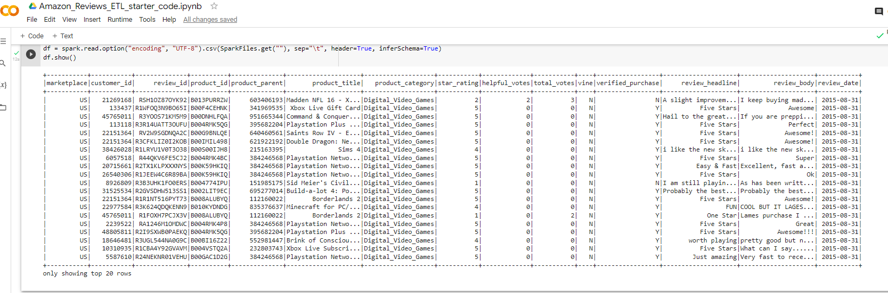
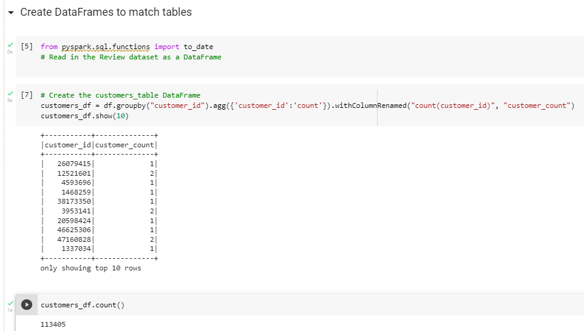
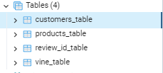
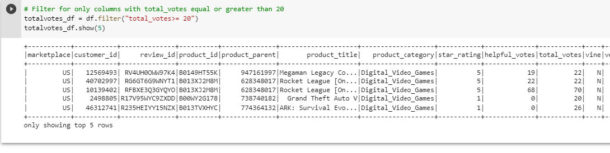
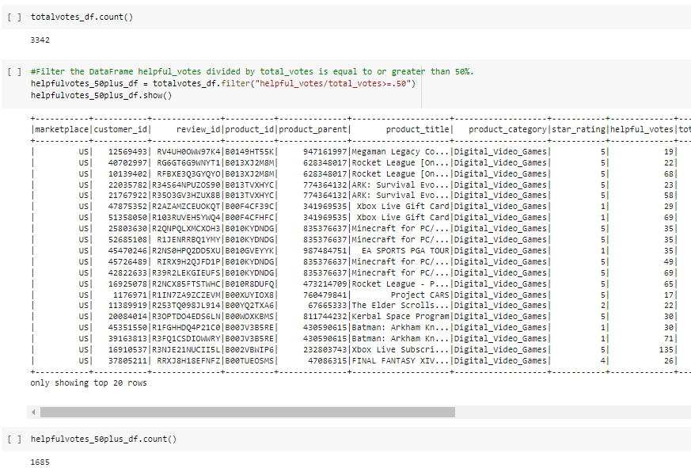

# Amazon_Vine_Analysis

## Overview

 The purpose of the project was to analyze Amazon reviews written by memebers of the paid Amazon Vine program,and to     determine if there is any bias between Vine and Non-Vine member's review.

 In order to determine if there is any bias towards favorable reviews from Vine memebers vs Non-members,we need to      identify the percentage of 5 Starratings to total rating.To complete this analysi,we were asked to choose 50       datasets  to extract,transform and load into a dataframe.Of the 50 datasets we chose,"Digital video Games" categoryto  analyze reviews that were made by users.For this analysis,we use:

    PySpark to extract the dataset,transform the data,connect to AWS RDS instance and load the transformed data into
    pgAmin.
    
    Google Colaboratory to import PySpark libraries and connect to Posstgres in order to create SQL tables and export
    the results.
    
    
   ## Results
   
  ### Inorder to focus on reviews data was extracted. please see below image of the data ,
   
   
   
   The extracted dataset was transformed into four dataframes to match tables.Please see the image below
   
   

   
   
   Similarly,each data frames were created,please refer Images folder.
   
   ### Then data was filtered into:
    
         1)  count of total_votes equal to or greater than 20 and
         
          2) helpful_votes divided by total _votes is equal to or greater than 50%
         
  Please see the images below for  result of total_votes and helpful_votes/total_votes 
  
  
  
  
  
     
     
     

      
     
     
   
   
   
   
   
   
