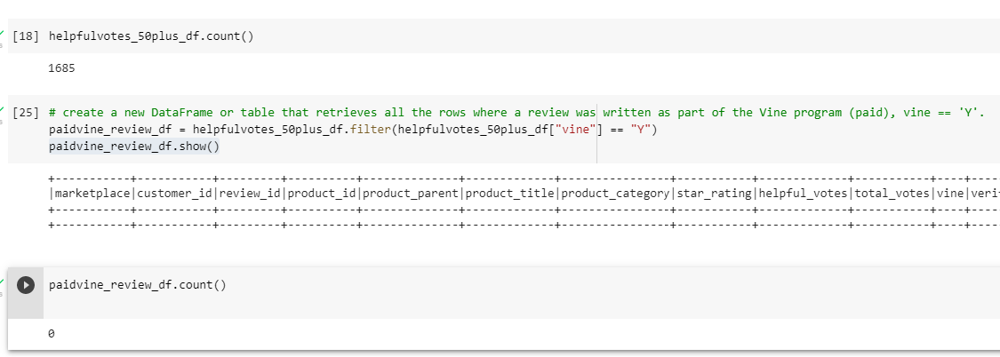
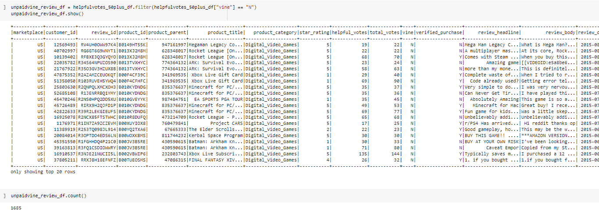

# Amazon_Vine_Analysis

## Overview

The purpose of the project was to analyze Amazon reviews written by members of the paid Amazon Vine program,and to determine if there is any bias between Vine and Non-Vine member's review.

In order to determine if there is any bias towards favorable reviews from Vine memebers vs Non-members,we need to identify the percentage of 5 Star ratings to total rating.To complete this analysi,we were asked to choose 50 datasets to extract,transform and load into a dataframe.Of the 50 datasets we chose,"Digital video Games" categoryto analyze reviews that were made by users.For this analysis,we use:

    PySpark to extract the dataset,transform the data,connect to AWS RDS instance and load the transformed data into
    pgAmin.
    
    Google Colaboratory to import PySpark libraries and connect to Posstgres in order to create SQL tables and export
    the results.
    
    
   ## Results
   
  ### Inorder to focus on reviews data was extracted. please see below image of the data ,
   
   
   
   The extracted dataset was transformed into four dataframes to match tables.Please see the image below
   
   

   
   
   Similarly,each data frames were created,please refer Images folder.
   
   ### Then data was filtered into:
    
         1)  count of total_votes equal to or greater than 20 and
         
         2) helpful_votes divided by total _votes is equal to or greater than 50%
         
  Please see the images below for  result of total_votes and helpful_votes/total_votes 
  
  
  
  
    
     
 
 
 Then created dataframe that retrieves all the rows wherea a review was wriiten as part paid Vine Program,vine ==Y and unpaid,vine ==N,then the 5-start reviews and
 percentage of 5-star reviews for both types.
 
 Pleases see below image of result
 
 
 
 
 
 
 
 
1) How many Vine reviews and non-Vine reviews were there?

    The dataset we chose was on smaller side for Big data with total reviews of about 145,431.When filtered for 20 or more  reviews the rest of analysis was around
    3,342 reviews and helpful_votes narrow down to 1,685 reviews.

    Due to applied criteria there were no reviews that were paid by Vine program and with a unpaid reviews of 1,685.

 
2) How many Vine reviews were 5 stars? How many non-Vine reviews were 5 stars?

    There were 0 paid Vine reviews with 5-star reviews and 631 unpaid Vine reviews with 5-star reviews.

3) What percentage of Vine reviews were 5 stars? What percentage of non-Vine reviews were 5 stars?

    The percentage for paid,5-star reviews would be 0%, where as the percentage of unpaid,5-start reviews was 37.4%.
   
 ## Summary
   
As the sample size was constricted to small size it was impossible to compare paid and unpaid Vine reviews ,but considering the analysis of unpaid reiviews the analysis was biased to unpaid Vine reviews.Additional analysis recommendation is to adjustments to these criteria for reconsidering dataset . Also more analysis with different products  helps to get a whole picture  of whether reviews are made by Vine members are bias.
 
 

      
     
     
   
   
   
   
   
   
